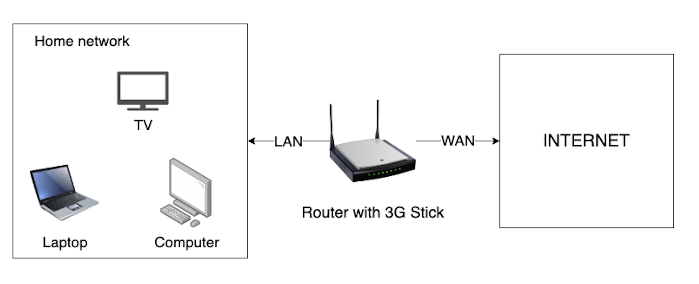
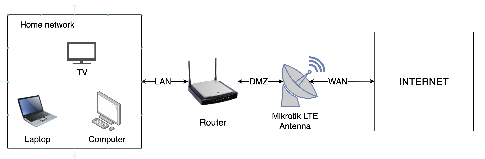
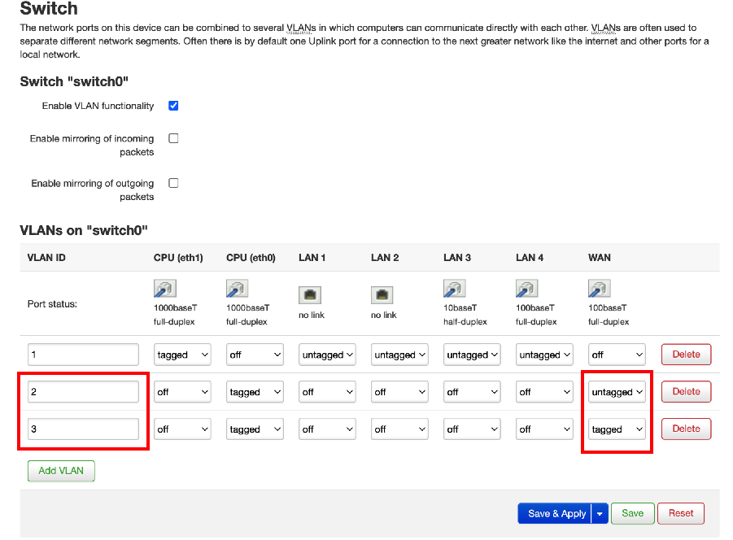
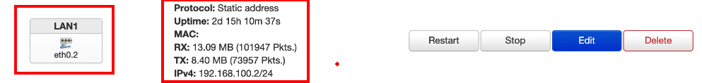
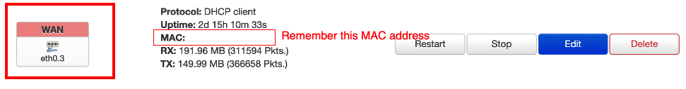
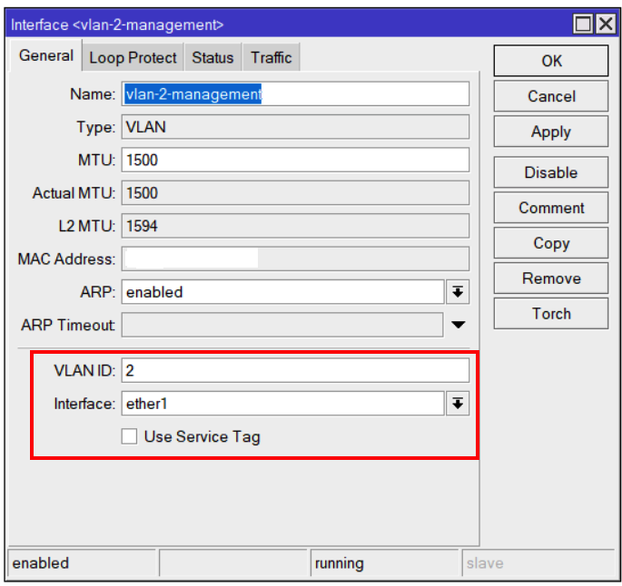
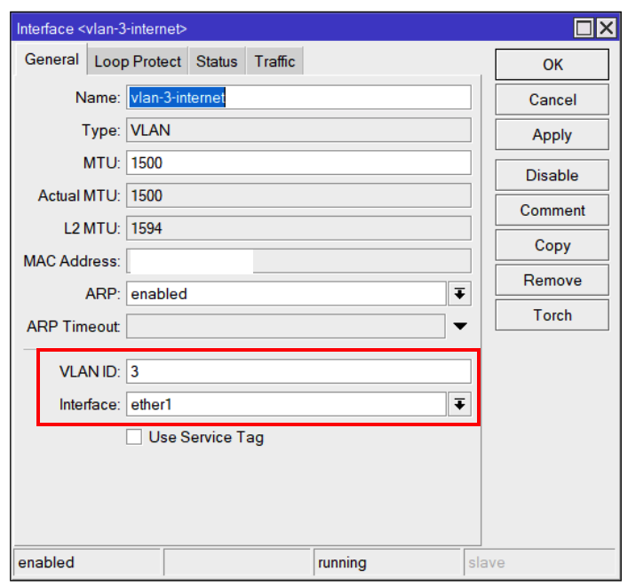
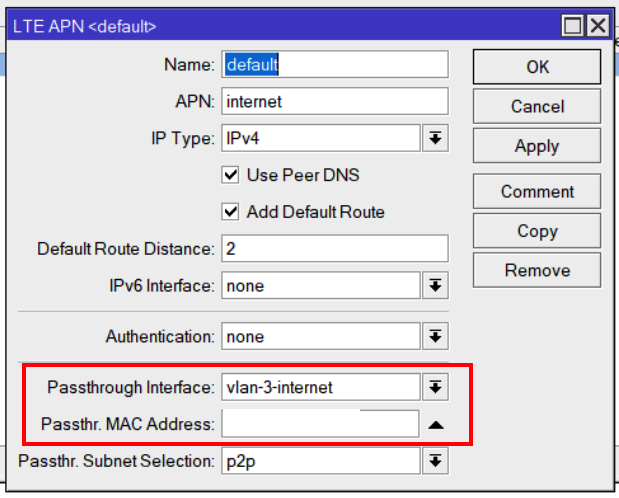

# The Goal
This article explains how to properly configure your Openwrt based router to work with Mikrotik antenna like 
[this](https://mikrotik.com/product/lhgg_lte6_kit) or [this](https://mikrotik.com/product/rblhgr) with [LTE pass through feature](https://wiki.mikrotik.com/wiki/Manual:Interface/LTE#Passthrough_Example) enabled.

# Background

I had a typical setup for my home router.
Home network + wan internet via 3g stick.

Later I've decided to replace 3g stick to LTE antenna to gain all benefits of LTE high speed
and now my setup looks like this.

# The problem
When I bought and configured Mikrotik antenna it turned out that it is a boarder device now, not router anymore.\
So I have to configure all the stuff like firewall/port forwarding/traffic rules/security on the Mikrotik device.\
That is annoying and not convenient. 

I just want my Mikrotik antenna to act like my old 3g stick plugged into my router.
Simple radio signal receiver not a separate network device that has a complex configuration. 

Luckily, Mikrotik shipped [new version of Router OS v6.41](https://mikrotik.com/download/changelogs/stable-release-tree) with the feature calls **LTE passthrough**.

It means that Mikrotik device passes through WAN IP obtained from internet provided to Openwrt based router,
and we do all configuration/firewalling/security on the router as we did before and don't need to deal with all the configuration burden
in the Mikrotik Router OS anymore.

# Solution
All instructions provided here was tested against Mikrotik antenna [LHG LTE6 kit](https://mikrotik.com/product/lhg_lte6_kit) (Router OS 6.49) and router [TP-Link Archer C7 v2](https://www.tp-link.com/en/home-networking/wifi-router/archer-c7/) (openwrt 19.07).\
For Router OS configuration I use [Winbox tool](https://mikrotik.com/download). 

## On the Openwrt side
### Step 1: Configure two VLAN's to negotiate with Mikrotik device
* Network -> Switch
* Enable VLAN functionality
* Add 2 VLAN's as shown on the picture bellow
* VLAN 2 untagged (management VLAN)
* VLAN 3 tagged (internet VLAN)
* Click Save & Apply

### Step 2: Configure interface on top of management VLAN 
* Network -> Interfaces -> Add new interface
* Name: whatever you want
* Protocol: Static address
* Interface: Switch VLAN: "eth0.2"
* Click "Create Interface"
* IPv4 address: IP from your Mikrotik network range (in my case 192.168.100.2, because Mikrotik itself has ip 192.168.100.1)
* IPv4 netmask: 255.255.255.0
* Click "Save"
* Click "Save & Apply"

### Step 3: Configure interface on top of internet VLAN
* Network -> Interfaces -> Add new interface
* Name: whatever you want (in my case WAN)
* Protocol: DHCP client
* Interface: Switch VLAN: "eth0.3"
* Click "Create Interface"
* Check "Bring up on boot"
* **REMEMBER MAC ADDRESS FROM THIS STEP**
* Click "Save"
* Click "Save & Apply"

## On the Mikrotik side
### Step 1: Create management VLAN on your ether1 interface
* Interfaces -> Interface (tab) -> select ether1 -> Click big plus -> VLAN
* Name: whatever you want
* VLAN ID: 2
* Interface: ether1
* Click OK

### Step 2: Create internet VLAN on your ether1 interface
* Interfaces -> Interface (tab) -> select ether1 -> Click big plus -> VLAN
* Name: whatever you want
* VLAN ID: 3
* Interface: ether1
* Click OK

### Step 3: Enable pass through for your internet VLAN
* Interfaces -> LTE (tab) -> select lte1 -> Click LTE APNs -> double-click default 
* Passthrough interface: name from step 2 (in my case vlan-3-internet)
* Passthr. MAC address: mac address from step 3 on the openwrt side
* Click OK

#### If you did all the steps correctly, Mikrotik should get WAN IP from your internet provider and assign it to your openwrt WAN interface.

### Enjoy ! :)